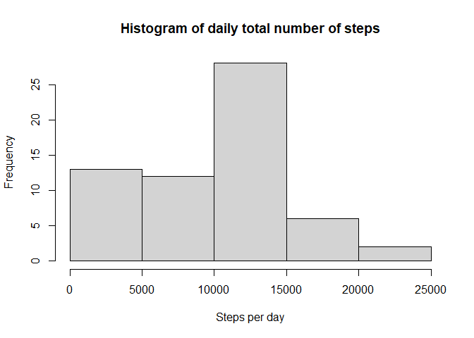
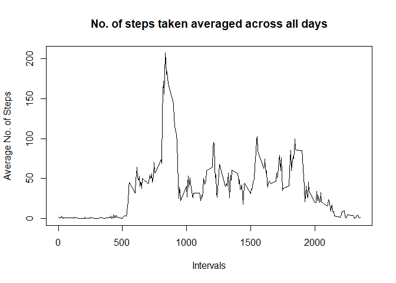
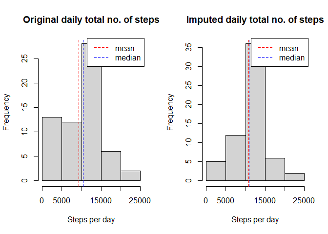
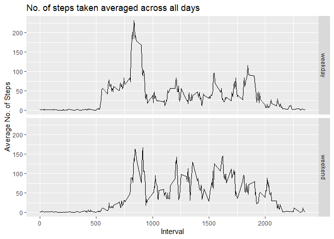

## Introduction

This is a submission for the [Course Project 1 of Reproducible Research course in Coursera](https://www.coursera.org/learn/reproducible-research/peer/gYyPt/course-project-1). 

This assignment makes use of data from a personal activity monitoring device. This device collects data at 5 minute intervals through out the day. The data consists of two months of data from an anonymous individual collected during the months of October and November, 2012 and include the number of steps taken in 5 minute intervals each day.

The entire assignment should be completed in a single R markdown document that can be processed by knitr and be transformed into an HTML file.

## Loading and preprocessing the data

This is the code to **Load the data** from the .csv file contained in the zip folder:


```r
dat <- readr::read_csv("activity.zip", col_names=TRUE, col_types="iDi", 
                       na="NA", n_max=17568)
```

This is the structure summary of the data:


```r
str(dat)
```

```
## tibble [17,568 x 3] (S3: spec_tbl_df/tbl_df/tbl/data.frame)
##  $ steps   : int [1:17568] NA NA NA NA NA NA NA NA NA NA ...
##  $ date    : Date[1:17568], format: "2012-10-01" "2012-10-01" ...
##  $ interval: int [1:17568] 0 5 10 15 20 25 30 35 40 45 ...
##  - attr(*, "spec")=
##   .. cols(
##   ..   steps = col_integer(),
##   ..   date = col_date(format = ""),
##   ..   interval = col_integer()
##   .. )
```

## What is mean total number of steps taken per day?

These are the codes to evaluate the following, ignoring the missing values:

1. Calculate the total number of steps taken per day.


```r
daily_total <- with(dat, tapply(steps, date, sum, na.rm=TRUE))

## This is just to see the structure summary of the new variable.
str(daily_total)
```

```
##  int [1:61(1d)] 0 126 11352 12116 13294 15420 11015 0 12811 9900 ...
##  - attr(*, "dimnames")=List of 1
##   ..$ : chr [1:61] "2012-10-01" "2012-10-02" "2012-10-03" "2012-10-04" ...
```
2. Make a histogram of the total number of steps taken each day.


```r
hist(daily_total, main="Histogram of daily total number of steps", 
     xlab="Steps per day")
```

<!-- -->

3. Calculate and report the mean and median of the total number of steps taken per day.
    + The **mean** is (note that there are no fraction of steps):
    
    ```r
    ceiling(mean(daily_total))
    ```
    
    ```
    ## [1] 9355
    ```
    + The **median** is:
    
    ```r
    median(daily_total)
    ```
    
    ```
    ## [1] 10395
    ```

## What is the average daily activity pattern?

These are the codes to evaluate the following, ignoring the missing values:

1. Make a time series plot (i.e. type = "l") of the 5-minute interval (x-axis) and the average number of steps taken, averaged across all days (y-axis).

The average is rounded up to the largest integer.


```r
## Calculation
ave_interval <- with(dat, tapply(steps, interval, FUN=function(x) ceiling(mean(x, na.rm=TRUE))))
ave_interval <- data.frame(interval=as.integer(names(ave_interval)), ave_interval)

##Plotting
with(ave_interval, plot(interval, ave_interval, type="l", 
                        main="No. of steps taken averaged across all days", 
                        xlab="Intervals", ylab="Average No. of Steps"))
```

<!-- -->

2. Which 5-minute interval, on average across all the days in the dataset, contains the maximum number of steps?

```r
ave_interval$interval[which.max(ave_interval$ave_interval)]
```

```
## [1] 835
```
Additionally, the maximum number of steps is:

```r
max(ave_interval$ave_interval)
```

```
## [1] 207
```

## Imputing missing values

There are a number of days/intervals where there are missing values (coded as NA). The presence of missing days may introduce bias into some calculations or summaries of the data. These are the codes to evaluate the following:

1. Calculate and report the total number of missing values in the dataset (i.e. the total number of rows with NAs)


```r
sum(is.na(dat$steps))
```

```
## [1] 2304
```
2. Devise a strategy for filling in all of the missing values in the dataset. The strategy used here is to replace the missing values with the mean for that 5-minute interval.

3. Create a new dataset that is equal to the original dataset but with the missing data filled in.

First, let's see a snapshot of the original dataset:

```r
dat[285:295, ]
```

```
## # A tibble: 11 x 3
##    steps date       interval
##    <int> <date>        <int>
##  1    NA 2012-10-01     2340
##  2    NA 2012-10-01     2345
##  3    NA 2012-10-01     2350
##  4    NA 2012-10-01     2355
##  5     0 2012-10-02        0
##  6     0 2012-10-02        5
##  7     0 2012-10-02       10
##  8     0 2012-10-02       15
##  9     0 2012-10-02       20
## 10     0 2012-10-02       25
## 11     0 2012-10-02       30
```

We replace the NA values with the mean for that 5-minute interval.

```r
## Create a new dataset.
dat_noNA <- dat

for (i in 1:length(dat_noNA$steps)) {
    if (is.na(dat_noNA$steps[i]) == TRUE)
        dat_noNA$steps[i] <- with(ave_interval, ave_interval[interval==dat_noNA$interval[i]])
}
```

This is a snapshot of the new dataset with missing values replaced:

```r
dat_noNA[285:295, ]
```

```
## # A tibble: 11 x 3
##    steps date       interval
##    <dbl> <date>        <int>
##  1     4 2012-10-01     2340
##  2     1 2012-10-01     2345
##  3     1 2012-10-01     2350
##  4     2 2012-10-01     2355
##  5     0 2012-10-02        0
##  6     0 2012-10-02        5
##  7     0 2012-10-02       10
##  8     0 2012-10-02       15
##  9     0 2012-10-02       20
## 10     0 2012-10-02       25
## 11     0 2012-10-02       30
```

4. Make a histogram of the total number of steps taken each day and Calculate and report the mean and median total number of steps taken per day. Do these values differ from the estimates from the first part of the assignment? What is the impact of imputing missing data on the estimates of the total daily number of steps?

We plot two histograms side by side for comparison and evaluate the impact of imputing missing data on the estimates of the total daily number of steps.


```r
## Computing new daily totals.
daily_total_n <- with(dat_noNA, tapply(steps, date, sum, na.rm=TRUE))

## Plotting 2 histograms for comparison.
par(mfrow=c(1,2))

hist(daily_total, main="Original daily total no. of steps", 
     xlab="Steps per day")
abline(v=ceiling(mean(daily_total)), lty=2, col="red")
abline(v=median(daily_total), lty=2, col="blue")
legend("topright", c("mean","median"), lty=2, col=c("red","blue"))

hist(daily_total_n, main="Imputed daily total no. of steps", 
     xlab="Steps per day")
abline(v=ceiling(mean(daily_total_n)), lty=2, col="red")
abline(v=median(daily_total_n), lty=2, col="blue")
legend("topright", c("mean","median"), lty=2, col=c("red","blue"))
```

<!-- -->

We also calculate the means and medians of the daily totals in the imputed data. 
    
* The **means** are (note that there are no fraction of steps):
    
    ```r
    data.frame(Means=c(ceiling(mean(daily_total)), ceiling(mean(daily_total_n))), 
               row.names = c("Original", "Imputed"))
    ```
    
    ```
    ##          Means
    ## Original  9355
    ## Imputed  10785
    ```
* The **medians** are:
    
    ```r
     data.frame(Median=c(median(daily_total), median(daily_total_n)), 
               row.names = c("Original", "Imputed"))
    ```
    
    ```
    ##          Median
    ## Original  10395
    ## Imputed   10909
    ```

As expected, the total number of steps per day has increased in the imputed data. This is because we filled in the missing values, thereby adding values in the total sums.

## Are there differences in activity patterns between weekdays and weekends?

The dataset with the filled-in missing values is used for this part. These are the codes to evaluate the following:

1. Create a new factor variable in the dataset with two levels – “weekday” and “weekend” indicating whether a given date is a weekday or weekend day.


```r
dat_noNA$weekday <- weekdays(dat_noNA$date, abbreviate = FALSE)
dat_noNA$weekday[with(dat_noNA, weekday=="Saturday" | weekday=="Sunday")] <- "weekend"
dat_noNA$weekday[dat_noNA$weekday != "weekend"] <- "weekday"
dat_noNA$weekday <- as.factor(dat_noNA$weekday)

## Printing the structure of the variable:
str(dat_noNA)
```

```
## tibble [17,568 x 4] (S3: spec_tbl_df/tbl_df/tbl/data.frame)
##  $ steps   : num [1:17568] 2 1 1 1 1 3 1 1 0 2 ...
##  $ date    : Date[1:17568], format: "2012-10-01" "2012-10-01" ...
##  $ interval: int [1:17568] 0 5 10 15 20 25 30 35 40 45 ...
##  $ weekday : Factor w/ 2 levels "weekday","weekend": 1 1 1 1 1 1 1 1 1 1 ...
##  - attr(*, "spec")=
##   .. cols(
##   ..   steps = col_integer(),
##   ..   date = col_date(format = ""),
##   ..   interval = col_integer()
##   .. )
```

2. Make a panel plot containing a time series plot (i.e. type = "l") of the 5-minute interval (x-axis) and the average number of steps taken, averaged across all weekday days or weekend days (y-axis). See the README file in the GitHub repository to see an example of what this plot should look like using simulated data.


```r
## Calculation
ave_interval_n <- with(dat_noNA, tapply(steps, list(interval, weekday), 
                                        FUN=function(x) ceiling(mean(x, na.rm=TRUE))))

## Transform to data frame
library(reshape)
ave_interval_n <- melt(ave_interval_n)
colnames(ave_interval_n)[1:2] <- c("Interval", "Weekday")

## Plotting. This uses ggplot2 package.
library(ggplot2)
ggplot(ave_interval_n, aes(Interval,value)) + geom_line() + facet_grid(Weekday~.) +
    labs(title = "No. of steps taken averaged across all days", y="Average No. of Steps")
```

<!-- -->
